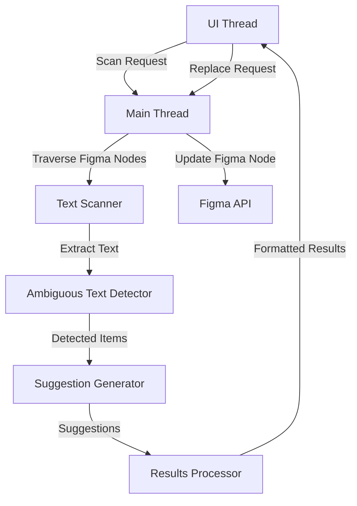

# 設計書

## 概要

Figma 曖昧テキスト検出プラグインは、Figma の API とインターフェースするメインプラグインスレッドと、ユーザーインタラクションを処理する UI スレッドから構成されるデュアルプロセスアーキテクチャとして設計されています。このプラグインは、Figma デザイン内のテキストノードをスキャンし、パターンマッチングを使用して日本語の曖昧な表現を検出し、文脈に応じた置換候補を生成し、ユーザーが変更を確認・適用するための直感的なインターフェースを提供します。

## アーキテクチャ

### プラグインアーキテクチャ

プラグインは、Figma の標準プラグインアーキテクチャに従い、2 つの主要コンポーネントで構成されています：

1. **メインスレッド (code.ts)**: Figma API との相互作用、テキストスキャン、データ処理を担当
2. **UI スレッド (ui.html/ui.js)**: ユーザーインターフェースの管理、結果表示、ユーザーインタラクションの処理を担当

### 通信フロー



## コンポーネントとインターフェース

### 1. テキストスキャナーコンポーネント

**目的**: Figma ドキュメントツリーを走査し、すべてのテキストコンテンツを抽出する

**Interface**:

```typescript
interface TextScanner {
  scanDocument(): Promise<TextNode[]>;
  scanPage(page: PageNode): TextNode[];
  extractTextContent(node: SceneNode): string | null;
}

interface TextNode {
  id: string;
  content: string;
  node: TextNode;
  location: NodeLocation;
}

interface NodeLocation {
  pageName: string;
  layerName: string;
  coordinates: { x: number; y: number };
}
```

### 2. Ambiguous Text Detector Component

**Purpose**: Identify ambiguous expressions in Japanese text using predefined patterns

**Interface**:

```typescript
interface AmbiguousTextDetector {
  detectAmbiguousText(text: string): AmbiguousMatch[];
  isAmbiguous(word: string): boolean;
}

interface AmbiguousMatch {
  originalText: string;
  ambiguousWord: string;
  startIndex: number;
  endIndex: number;
  context: string;
}
```

**Detection Patterns**:

- これ (kore - this)
- それ (sore - that)
- あれ (are - that over there)
- こちら (kochira - this way/this one)
- そちら (sochira - that way/that one)
- あちら (achira - that way/that one over there)
- こんな (konna - this kind of)
- そんな (sonna - that kind of)
- あんな (anna - that kind of)

### 3. Suggestion Generator Component

**Purpose**: Generate contextually appropriate replacement suggestions

**Interface**:

```typescript
interface SuggestionGenerator {
  generateSuggestions(match: AmbiguousMatch): Suggestion[];
  getContextualSuggestions(context: string, ambiguousWord: string): string[];
}

interface Suggestion {
  replacementText: string;
  confidence: number;
  category: SuggestionCategory;
}

enum SuggestionCategory {
  UI_ELEMENT = "ui_element",
  ACTION = "action",
  CONTENT = "content",
  GENERIC = "generic",
}
```

**Suggestion Strategy**:

- Context analysis based on surrounding words
- Common UI patterns (buttons, forms, navigation)
- Action-oriented replacements for interactive elements
- Content-specific suggestions for informational text

### 4. Results Manager Component

**Purpose**: Manage detected items and coordinate replacement operations

**Interface**:

```typescript
interface ResultsManager {
  processResults(
    textNodes: TextNode[],
    matches: AmbiguousMatch[]
  ): DetectionResult[];
  applyReplacement(nodeId: string, replacement: string): Promise<boolean>;
  removeProcessedItem(itemId: string): void;
}

interface DetectionResult {
  id: string;
  nodeId: string;
  originalText: string;
  ambiguousMatch: AmbiguousMatch;
  suggestions: Suggestion[];
  location: NodeLocation;
  status: ProcessingStatus;
}

enum ProcessingStatus {
  PENDING = "pending",
  REPLACED = "replaced",
  SKIPPED = "skipped",
}
```

### 5. UI Controller Component

**Purpose**: Manage user interface interactions and state

**Interface**:

```typescript
interface UIController {
  displayResults(results: DetectionResult[]): void;
  handleReplacementSelection(itemId: string, suggestion: Suggestion): void;
  showProgress(current: number, total: number): void;
  navigateToNode(nodeId: string): void;
}
```

## Data Models

### Core Data Structures

```typescript
// Main data model for plugin state
interface PluginState {
  isScanning: boolean;
  results: DetectionResult[];
  currentPage: string;
  scanProgress: ScanProgress;
}

interface ScanProgress {
  current: number;
  total: number;
  currentOperation: string;
}

// Configuration for ambiguous text patterns
interface DetectionConfig {
  patterns: AmbiguousPattern[];
  suggestionRules: SuggestionRule[];
}

interface AmbiguousPattern {
  word: string;
  variants: string[];
  contextHints: string[];
}

interface SuggestionRule {
  pattern: string;
  contextKeywords: string[];
  suggestions: string[];
  priority: number;
}
```

## Error Handling

### Error Categories and Handling Strategy

1. **Figma API Errors**

   - Network connectivity issues
   - Permission errors
   - Node access failures
   - Strategy: Graceful degradation with user notification

2. **Text Processing Errors**

   - Invalid character encoding
   - Malformed text content
   - Strategy: Skip problematic nodes and continue processing

3. **UI Errors**

   - Rendering failures
   - User interaction errors
   - Strategy: Reset UI state and provide error feedback

4. **Performance Issues**
   - Large document processing
   - Memory constraints
   - Strategy: Implement batching and progress indicators

### Error Recovery Mechanisms

```typescript
interface ErrorHandler {
  handleFigmaAPIError(error: FigmaError): void;
  handleTextProcessingError(error: ProcessingError, nodeId: string): void;
  handleUIError(error: UIError): void;
  reportError(error: Error, context: string): void;
}

interface ErrorRecovery {
  retryOperation(
    operation: () => Promise<any>,
    maxRetries: number
  ): Promise<any>;
  skipAndContinue(nodeId: string, reason: string): void;
  resetPluginState(): void;
}
```

## Testing Strategy

### Unit Testing

- **Text Scanner**: Test node traversal and text extraction
- **Ambiguous Text Detector**: Test pattern matching accuracy
- **Suggestion Generator**: Test suggestion quality and relevance
- **Results Manager**: Test data management and replacement operations

### Integration Testing

- **Figma API Integration**: Test plugin communication with Figma
- **End-to-End Workflows**: Test complete scan-to-replacement flows
- **Cross-Platform Compatibility**: Test web and desktop versions

### Performance Testing

- **Large Document Handling**: Test with designs containing 1000+ text nodes
- **Memory Usage**: Monitor memory consumption during processing
- **Response Time**: Ensure UI remains responsive during operations

### Test Data

- Sample Figma files with various Japanese text patterns
- Edge cases: empty text, special characters, mixed languages
- Performance test files with large amounts of text content

### Testing Framework

```typescript
interface TestSuite {
  unitTests: UnitTest[];
  integrationTests: IntegrationTest[];
  performanceTests: PerformanceTest[];
}

interface UnitTest {
  component: string;
  testCases: TestCase[];
}

interface TestCase {
  name: string;
  input: any;
  expectedOutput: any;
  setup?: () => void;
  teardown?: () => void;
}
```

## Implementation Considerations

### Japanese Text Processing

- Use Unicode-aware string processing for proper Japanese character handling
- Implement proper tokenization for Japanese text (considering hiragana, katakana, kanji)
- Handle mixed-script text (Japanese + English/numbers)

### Performance Optimization

- Implement lazy loading for large document processing
- Use Web Workers for text processing if available
- Cache processed results to avoid re-scanning unchanged content

### User Experience

- Provide clear visual feedback during scanning operations
- Implement keyboard shortcuts for common operations
- Support undo/redo for replacement operations
- Maintain plugin state across Figma sessions where possible

### Accessibility

- Ensure plugin UI is keyboard navigable
- Provide appropriate ARIA labels for screen readers
- Use sufficient color contrast for visual elements
- Support high contrast mode
